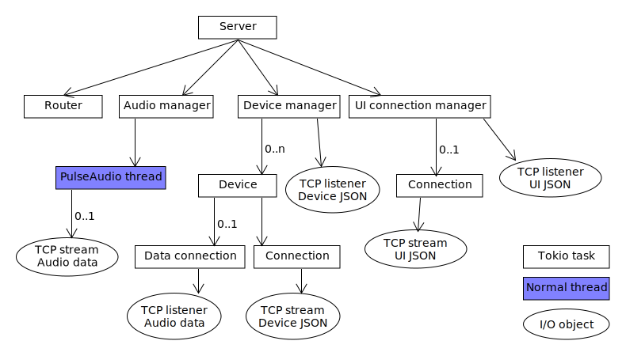
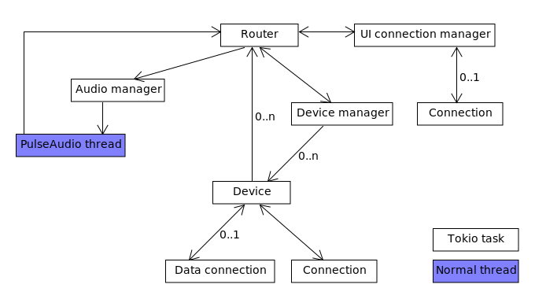

# About app's architechture

Last update: 2022-01-12

## High level architechture

## Server

### Internal structure

### Component communication

Components which are Tokio tasks or normal threads use message passing to
communicate.

### Data storage

Rust app (server, test client and GUI) creates TOML settings file. But it is not used
for anything usefull so there is no diagram about it.
